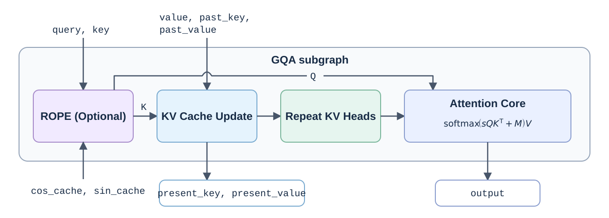

# GQA as a WebNN Subgraph

The [JavaScript pseudocode](gqa-subgraph.mjs) uses Grouped-Query Attention (GQA) to explore how a WebNN subgraph could expose configuration and preserve a high-level operation boundary. The motivating frontend is **ONNX model → ORT WebNN EP**.

The example is intentionally small. Index construction, mask construction, and typed scalar packing are described as abbreviated helpers.

## Decomposition overview

In the current WebNN EP implementation, the GQA subgraph primarily consists of the following blocks:



## Define and invoke

```js
import {GQAConfig, buildGQASubgraph} from "./gqa-subgraph.mjs";

const config = new GQAConfig({
  do_rotary: true,
  scale: 0.08838, // Optional; otherwise derive 1/sqrt(headSize).
});

// Existing MLOperands from the surrounding model graph.
const operands = {
  query, key, value, past_key, past_value,
  seqlens_k, total_sequence_length, cos_cache, sin_cache,
};

const GQA = await buildGQASubgraph(builder, operands, config);
const {output, present_key, present_value} = builder.subgraph(GQA, operands);
```

`GQAConfig` here is a data-only JavaScript class in the example, not a WebNN API type.

The definition helper uses the surrounding graph's `builder`. It creates formal inputs from the supplied operands' shapes and data types, constructs the body using `config`, then returns:

```js
builder.buildSubgraph(outputs, {name: "GQA", inputs, config});
```

In this proposed API, `buildSubgraph()` scopes the listed formal inputs to the subgraph definition and leaves the builder available for further graph construction. `builder.subgraph(GQA, operands)` binds the surrounding operands to those inputs by name.

### Inputs and outputs

Input names follow [contrib GQA](https://github.com/microsoft/onnxruntime/blob/main/docs/ContribOperators.md#com.microsoft.GroupQueryAttention). This example uses separate, head-shaped Q/K/V and preallocated KV caches.

| Input | Role |
|---|---|
| `query`, `key`, `value` | Current Q/K/V, with explicit head dimensions |
| `past_key`, `past_value` | Previous KV caches |
| `seqlens_k` | Required: each batch item's valid total length after this call minus one |
| `total_sequence_length` | Required: maximum valid total length across the batch |
| `cos_cache`, `sin_cache` | Rotary tables, required only when `do_rotary` is enabled |
| `position_ids` | Optional explicit ROPE positions |

The subgraph returns **three outputs**: `output`, `present_key`, and `present_value`.

### Attaching config to a subgraph

A subgraph boundary identifies a functional region, but its primitive operations do not always make the original high-level choices explicit. Attaching config to the definition can preserve information that is difficult or impossible to recover from the decomposed body:

- **Difficult to recover: `do_rotary`.** Recognizing ROPE requires matching a pattern of primitive operations. An explicit flag records this choice and controls whether the subgraph includes the ROPE region.
- **Impossible to recover exactly: the original `scale`.** Distinct FP32 values such as `0.08838` and `0.08839` both round to the FP16 multiplier `0.08837890625`. The primitive constant cannot distinguish them; config can retain the original value.

Shapes, head counts, and data types can be read from operand descriptors, so they need not be duplicated in config. 